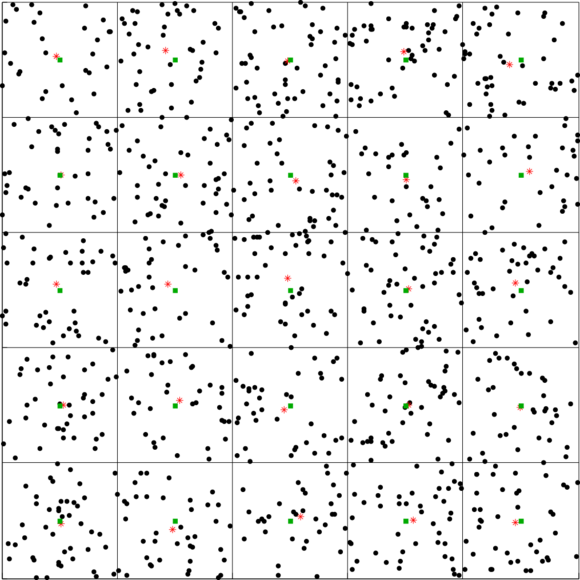

| [Tutorials Home](index.md)    | [Previous](Transformations.md) | [Next](TransformationDev.md) |
| ------------- |:-------------:| -----:|

# Creating a DataPointsFilter

In the following tutorials we will discuss how you can extend the functionality provided in _libpointmatcher_ by taking advantage of its modular design.  The following tutorial will detail the development of a a new data filter, which is as of yet not included in libpointmatcher.  You may wish to develop customized DataPointFilters, Transformations, OutlierFilters which best fit your project.  However, if you believe that your own contributions would benefit a larger user base, please contact us to see how we can integrate them into libpointmatcher.

## Generic procedure

For a more detailed procedure or if it's the first time developping a filter, please see the example of the [VoxelGrid filter](#voxelgridhead). Here, to implement a _Dummy_ filter we have to follow these steps:

1. Create files in the [pointmatcher/DataPointsFilters/](/pointmatcher/DataPointsFilters/) folder
	- the header : `Dummy.h`
	- the implementation file : `Dummy.cpp`
1. Declare your filter in the header with the minimal following interface:
	```cpp
	template <typename T>
	struct DummyDataPointsFilter : public PointMatcher<T>::DataPointsFilter
	{
		typedef PointMatcherSupport::Parametrizable P;
		typedef P::Parameters Parameters;
		typedef P::ParameterDoc ParameterDoc;
		typedef P::ParametersDoc ParametersDoc;
		
		typedef typename PointMatcher<T>::DataPoints DataPoints;
		
		inline static const std::string description()
		{
			return "description";
		}
		inline static const ParametersDoc availableParameters()
		{
			return boost::assign::list_of<ParameterDoc>
			( "param", "param desc", "default value", "lower bound", "upper bound", &P::Comp<value_type> )
			;
		}

		DummyDataPointsFilter(const Parameters& params = Parameters());
		virtual ~DummyDataPointsFilter() {};
		virtual DataPoints filter(const DataPoints& input);
		virtual void inPlaceFilter(DataPoints& cloud);
	};
	```
1. Implement the filter in the `.cpp` file and declare the template at the end of the file as follow:
	```cpp
	template struct DummyDataPointsFilter<float>;
	template struct DummyDataPointsFilter<double>;
	```
1. Declare the filter in [pointmatcher/DataPointsFiltersImpl.h](/pointmatcher/DataPointsFiltersImpl.h) as follow:
	```cpp
	#include "DataPointsFilters/Dummy.h"
	template<typename T>
	struct DataPointsFiltersImpl
	{
		/* other filters declaration */
		/* our declaraction -> */ typedef ::DummyDataPointsFilter<T> DummyDataPointsFilter;
	};
	```
1. Add it to the _Registry_ [pointmatcher/Registry.cpp](/pointmatcher/Registry.cpp)
	- If the filter has some parameters:
	```cpp
	ADD_TO_REGISTRAR(DataPointsFilter, DummyDataPointsFilter, typename DataPointsFiltersImpl<T>::DummyDataPointsFilter)
	```
	- If not:
	```cpp
	ADD_TO_REGISTRAR_NO_PARAM(DataPointsFilter, DummyDataPointsFilter, typename DataPointsFiltersImpl<T>::DummyDataPointsFilter)
	```
1. Finally, add the source file in the [CMakeLists.txt](/CMakeLists.txt) in the `POINTMATCHER_SRC` variable.


## The Voxel Grid Filter <a name="voxelgridhead"></a>
The filter we wish to implement today is a voxel grid filter.  The latter falls into the class of *down-sampling filters*, in that it reduces the number of points in a cloud, as opposed to *descriptive filters* which add information to the points.

The voxel grid filter down-samples the data by taking a spatial average of the points in the cloud.  In the 2D case, one can simply imagine dividing the plane into a regular grid of rectangles.  While the term is more suited to 3D spaces, these rectangular areas are known as *voxels*. The sub-sampling rate is adjusted by setting the voxel size along each dimension.  The set of points which lie within the bounds of a voxel are assigned to that voxel and will be combined into one output point.

There are two options as to how to represent the distribution of points in a voxel by a single point. In the first, we take the centroid or spatial average of the point distribution.  In the second, we simply take the geometrical center of the voxel. Clearly, the first option is more accurate since it takes into account the point distribution inside the voxels. However it is more computationally intensive since the centroid must be computed for each voxel.  The computational cost increases linearly with the number of points in the cloud and the number of voxels.

In the following figure we show the application of a 2D voxel filter over a 2D point cloud containing uniformly dispersed points.  We divide each axis into 5 regions resulting in 25 voxels.  The points are down-sampled by taking the centroid of the points within each voxel.  The centroids are shown in red asterisks.  The centers of the voxels are shown in green squares.

|**Figure 1:** A 2D Voxel Grid with red stars representing the voxel centroids |
|:---|
||

## Implementation as a DataPointsFilter

### Overview
We will now implement the voxel grid within the framework of libpointmatcher.  Our implementation of the voxel grid filter will support 2D and 3D data and will be parametrized to support different voxel sizes and both down-sampling methods mentioned above.

|Parameter  |Description  |Default value    |Allowable range|
|---------  |:---------|:----------------|:--------------|
|vSizeX     |Size of the voxel along the x-axis | 1.0 | ]0 ; +inf[|
|vSizeY     |Size of the voxel along the y-axis | 1.0 | ]0 ; +inf[|
|vSizeZ     |Size of the voxel along the z-axis | 1.0 | ]0 ; +inf[|
|useCentroid|If 1, down-sample by using the centroid of each voxel.  If 0, use the voxel center | 1 | 1 or 0|
|averageExistingDescriptors|If 1, descriptors are down-sampled by taking their average in the voxel.  If 0, we use the descriptors from the first point found in the voxel | 1 | 1 or 0|

### Declaration

The implementations of data point filters are declared in [pointmatcher/DataPointsFilters/](/pointmatcher/DataPointsFilters/). In this folder, we add a new header and source file to implement our filter: for instance, here we create the file [pointmatcher/DataPointsFilters/VoxelGrid.h](/pointmatcher/DataPointsFilters/VoxelGrid.h). In this file, we declare a new templated struct called `VoxelGridDataPointsFiler`. This class is derived from the general class `PointMatcher<T>::DataPointsFilter` so as to inherit pure virtual methods and functionality that are common to all data point filters.

**Note:** *Libpointmatcher is a templated library and supports data of either float or double types. This allows users the flexibility of selecting between two levels of precision depending on the requirements of their application. As a result, classes which are added to libpointmatcher should be templated so as to support both types.*

```cpp
template <typename T>
struct VoxelGridDataPointsFilter : public PointMatcher<T>::DataPointsFilter
```

In order to register the voxel grid filter as a parameterizable module in libpointmatcher we must define the two following static functions:

```cpp
inline static const std::string description()
	{
		return "Construct Voxel grid of point cloud. Down-sample by taking centroid or center of grid cells./n";
	}
```

This function should return a string containing a short description of what the filter does.  The description will be printing when listing available modules in libpointmatcher.

```cpp
inline static const ParametersDoc availableParameters()
	{
		return boost::assign::list_of<ParameterDoc>
			( "vSizeX", "Dimension of each voxel cell in x direction", "1.0", "-inf", "inf", &P::Comp<T> )
			( "vSizeY", "Dimension of each voxel cell in y direction", "1.0", "-inf", "inf", &P::Comp<T> )
			( "vSizeZ", "Dimension of each voxel cell in z direction", "1.0", "-inf", "inf", &P::Comp<T> )
			( "useCentroid", "If 1 (true), down-sample by using centroid of voxel cell.  If false (0), use center of voxel cell.", "1", "0", "1", P::Comp<bool> )
			( "averageExistingDescriptors", "whether the filter average the descriptor values in a voxel or use a single value", "1", "0", "1", &P::Comp<T> )
		;
	}
```
This function should return the list of parameters or settings used by this filter.  The parameters are stored in a struct called `ParameterDoc`.  A parameter is defined by providing:

1. A string with the name of the parameter in camelcase
2. A string containing the description of the parameter
3. A string containing the default value of this parameter
4. If the bounds are checked, a string containing the minimum value of this parameter
5. If the bounds are checked, a string containing the maximum value of this parameter
6. If the parameter contains a non-standard type, the pointer to a comparison function for the parameter values

One can use the boost convenience function `boost::assign::list_of` to define a parameter in one line of c++.  We define a constructor taking as argument a list of parameters.  These parameters are stored in the voxel grid filter member variables.

```cpp
VoxelGridDataPointsFilter(const Parameters& params);
const T vSizeX;
const T vSizeY;
const T vSizeZ;
const bool useCentroid;
const bool averageExistingDescriptors;
```

For convenience, we declare a `Voxel` struct which will contain the following two pieces of information about a voxel:

```cpp
struct Voxel {
        unsigned int    numPoints;
        unsigned int    firstPoint;
        Voxel() : numPoints(0), firstPoint(0) {}
	};
```

1. `numPoints` : The total number of points contained in a voxel  
2. `firstPoint`: The index of the first point contained in a voxel (corresponding column of the DataPoints object)

`DataPointsFilter` contains two pure virtual functions which we must define in order to complete the implementation of our filter.

```cpp
virtual DataPoints filter(const DataPoints& input);
virtual void inPlaceFilter(DataPoints& cloud);
```

The `filter` function performs the filter operation on the input point cloud and returns the down-sampled point cloud. This function in fact calls the `inPlaceFilter` function which performs the filtering operation by directly modifying the input point cloud.  The use of an "in place filter" may be preferable if we do not need to keep an intact copy of the input as we do not need to create a new point cloud to hold the output and the memory footprint is thus lower.  This can make a difference when operating on large point clouds with many voxels.

### Implementation of the Filter

The implementation of the filter must be in the file [pointmatcher/DataPointsFilters/VoxelGrid.cpp](/pointmatcher/DataPointsFilters/VoxelGrid.cpp) that should also be added to the [CMakelists.txt](/CMakelists.txt) in the `POINTMATCHER_SRC` variable.

The steps performed by the filter are all contained in the `inPlaceFilter` function.  Because the voxel grid filter does not sub-sample points from the input but rather creates new points, we use the following strategy for performing in place filtering.  

1. **Voxel Assignment**<br> We pass through the input point cloud and assign each point to a voxel while recording the number of points contained in each voxel.  We record the index of the first point that is assigned to a given voxel.  This point will be modified to contain the down-sampled point representing the voxel.

2. **Voxel Point Computation**<br>
*Centroid Downsampling* <br>
a) Make a second pass through the input cloud and compute the sum of point positions in each given voxel.  This sum is stored in the place of the first point of a voxel.  If the descriptors are to be averaged, we store their sum in the place of the first point's descriptors.
<br>
b) The first points containing the summed points are normalized by the number of points in the voxel.  Similarly, the descriptors are normalized by the number of points. If a voxel does not contain any points, it is discarded. <br>
*Center Downsampling*<br>
a) If we wish to keep an average of the descriptors, we need to make an extra pass through the data to sum up the descriptors.  The first points are replaced by the center of the voxels and the descriptors are normalized.

3. **Point Cloud Truncation**<br> The down-sampled points to be kept are sorted by index, and are moved to the beginning of the point cloud.  The latter is then truncated to only contain the down-sampled points.
  
#### Initiation
```cpp
const int numPoints(cloud.features.cols());
const int featDim(cloud.features.rows());
const int descDim(cloud.descriptors.rows());

assert (featDim == 3 || featDim == 4);

int insertDim(0);
if (averageExistingDescriptors)
{
	for(unsigned int i = 0; i < cloud.descriptorLabels.size(); i++)
		insertDim += cloud.descriptorLabels[i].span;
	if (insertDim != descDim)
		throw InvalidField("VoxelGridDataPointsFilter: Error, descriptor labels do not match descriptor data");
}

```
In the initiation phase we obtain the number of points, the feature and descriptor dimensions from the input point cloud.  We check also check that the descriptor fields are valid.

#### 1. Voxel Assignment
```cpp
// Calculate number of divisions along each axis
Vector minValues = cloud.features.rowwise().minCoeff();
Vector maxValues = cloud.features.rowwise().maxCoeff();

T minBoundX = minValues.x() / vSizeX;
T maxBoundX = maxValues.x() / vSizeX;
T minBoundY = minValues.y() / vSizeY;
T maxBoundY = maxValues.y() / vSizeY;
T minBoundZ = 0;
T maxBoundZ = 0;

if (featDim == 4)
{
    minBoundZ = minValues.z() / vSizeZ;
    maxBoundZ = maxValues.z() / vSizeZ;
}

// number of divisions is total size / voxel size voxels of equal length + 1
// with remaining space
unsigned int numDivX = 1 + maxBoundX - minBoundX;
unsigned int numDivY = 1 + maxBoundY - minBoundY;;
unsigned int numDivZ = 0;

// If a 3D point cloud
if (featDim == 4 )
    numDivZ = 1 + maxBoundZ - minBoundZ;

unsigned int numVox = numDivX * numDivY;
if ( featDim == 4)
    numVox *= numDivZ;

// Assume point cloud is randomly ordered
// compute a linear index of the following type
// i, j, k are the component indices
// nx, ny number of divisions in x and y components
// idx = i + j * nx + k * nx * ny
std::vector<unsigned int> indices(numPoints);

// vector to hold the first point in a voxel
// this point will be ovewritten in the input cloud with
// the output value
std::vector<Voxel>* voxels;

// try allocating vector. If too big return error
try {
    voxels = new std::vector<Voxel>(numVox);
} catch (std::bad_alloc&) {
    throw InvalidParameter((boost::format("VoxelGridDataPointsFilter: Memory allocation error with %1% voxels.  Try increasing the voxel dimensions.") % numVox).str());
}

for (int p = 0; p < numPoints; p++ )
{
    unsigned int i = floor(cloud.features(0,p)/vSizeX - minBoundX);
    unsigned int j = floor(cloud.features(1,p)/vSizeY- minBoundY);
    unsigned int k = 0;
    unsigned int idx;
    if ( featDim == 4 )
    {
        k = floor(cloud.features(2,p)/vSizeZ - minBoundZ);
        idx = i + j * numDivX + k * numDivX * numDivY;
    }
    else
    {
        idx = i + j * numDivX;
    }

    unsigned int pointsInVox = (*voxels)[idx].numPoints + 1;

    if (pointsInVox == 1)
    {
        (*voxels)[idx].firstPoint = p;
    }

    (*voxels)[idx].numPoints = pointsInVox;

    indices[p] = idx;

}

```
The bounding area of the point cloud is calculated by finding the minimum and maximum positions in the feature dimensions.  The number of divisions along each direction which form a voxel are calculated by dividing the bounding box size by the voxel size.  Note that unless the bounding box size is an exact multiple of the voxel size, the voxels cannot all be the same size.  We simply use N-1 voxels of equal size and the remaining space is used by the last voxel.

Each voxel is identified by a unique linear index.  If i,j,k represent the voxel indices in the x,y,z dimensions respectively, the formula to encode the linear index is the following: idx = i + j * numDivX + k * numDivX * numDivY.  Each point in the cloud is given a voxel index.  The number of points and the first point in a given voxel is recorded in a vector of `Voxel` objects.

#### 2. Voxel Point Computation
##### Using the Centroid
```cpp
// store which points contain voxel position
std::vector<unsigned int> pointsToKeep;

// Store voxel centroid in output
if (useCentroid)
{
    // Iterate through the indices and sum values to compute centroid
    for (int p = 0; p < numPoints ; p++)
    {
        unsigned int idx = indices[p];
        unsigned int firstPoint = (*voxels)[idx].firstPoint;

        // If this is the first point in the voxel, leave as is
        // if not sum up this point for centroid calculation
        if (firstPoint != p)
        {
        	// Sum up features and descriptors (if we are also averaging descriptors)

        	for (int f = 0; f < (featDim - 1); f++ )
        	{
        		cloud.features(f,firstPoint) += cloud.features(f,p);
        	}

        	if (averageExistingDescriptors) 
        	{
        		for (int d = 0; d < descDim; d++)
        		{
        			cloud.descriptors(d,firstPoint) += cloud.descriptors(d,p);
        		}
        	}
        }
    }

    // Now iterating through the voxels
    // Normalize sums to get centroid (average)
    // Some voxels may be empty and are discarded
    for( int idx = 0; idx < numVox; idx++)
    {
        unsigned int numPoints = (*voxels)[idx].numPoints;
        unsigned int firstPoint = (*voxels)[idx].firstPoint;
        if(numPoints > 0)
        {
            for ( int f = 0; f < (featDim - 1); f++ )
            cloud.features(f,firstPoint) /= numPoints;

            if (averageExistingDescriptors) {
            	for ( int d = 0; d < descDim; d++ )
              cloud.descriptors(d,firstPoint) /= numPoints;
          }

          pointsToKeep.push_back(firstPoint);
      }
  }
}
```
We make a second pass through the data and take the sum of the features in the place of each voxel's first point.  If needed, the descriptors are also summed up.  We then iterate through the voxels and normalize non empty voxels.  Their first points are recorded to be ignored by the truncation operation applied at the end of filtering.

##### Using Centers

```cpp
// Although we don't sum over the features, we may still need to sum the descriptors
if (averageExistingDescriptors)
{
	// Iterate through the indices and sum values to compute centroid
	for (int p = 0; p < numPoints ; p++)
	{
		unsigned int idx = indices[p];
		unsigned int firstPoint = (*voxels)[idx].firstPoint;

		// If this is the first point in the voxel, leave as is
		// if not sum up this point for centroid calculation
		if (firstPoint != p)
		{
			for (int d = 0; d < descDim; d++ )
			{
				cloud.descriptors(d,firstPoint) += cloud.descriptors(d,p);
			}
		}
	}
}

for (int idx = 0; idx < numVox; idx++)
{
    unsigned int numPoints = (*voxels)[idx].numPoints;
    unsigned int firstPoint = (*voxels)[idx].firstPoint;

    if (numPoints > 0)
    {
        // get back voxel indices in grid format
        // If we are in the last division, the voxel is smaller in size
        // We adjust the center as from the end of the last voxel to the bounding area
        unsigned int i = 0;
        unsigned int j = 0;
        unsigned int k = 0;
        if (featDim == 4)
        {
            k = idx / (numDivX * numDivY);
            if (k == numDivZ)
                cloud.features(3,firstPoint) = maxValues.z() - (k-1) * vSizeZ/2;
            else
                cloud.features(3,firstPoint) = k * vSizeZ + vSizeZ/2;
        }

        j = (idx - k * numDivX * numDivY) / numDivX;
        if (j == numDivY)
            cloud.features(2,firstPoint) = maxValues.y() - (j-1) * vSizeY/2;
        else
            cloud.features(2,firstPoint) = j * vSizeY + vSizeY / 2;

        i = idx - k * numDivX * numDivY - j * numDivX;
        if (i == numDivX)
            cloud.features(1,firstPoint) = maxValues.x() - (i-1) * vSizeX/2;
        else
            cloud.features(1,firstPoint) = i * vSizeX + vSizeX / 2;

        // Descriptors : normalize if we are averaging or keep as is
        if (averageExistingDescriptors) {
        	for ( int d = 0; d < descDim; d++ )
        		cloud.descriptors(d,firstPoint) /= numPoints;
        }

        pointsToKeep.push_back(firstPoint);
    }
}

// deallocate voxels vector
delete voxels;
```
If we are averaging descriptors, we perform a summing step as in the previous case.  We then iterate through the voxels and replace the first point from each non-empty voxel with the voxel center.  If descriptors are averaged, these are normalized as well.  We also record the points to keep during the truncation process.

#### 3. Point Cloud Truncation

```cpp
// Move the points to be kept to the start
// Bring the data we keep to the front of the arrays then
// wipe the leftover unused space.
std::sort(pointsToKeep.begin(), pointsToKeep.end());
int numPtsOut = pointsToKeep.size();
for (int i = 0; i < numPtsOut; i++){
	int k = pointsToKeep[i];
	assert(i <= k);
	cloud.features.col(i) = cloud.features.col(k);
	if (cloud.descriptors.rows() != 0)
		cloud.descriptors.col(i) = cloud.descriptors.col(k);
}
cloud.features.conservativeResize(Eigen::NoChange, numPtsOut);
cloud.descriptors.conservativeResize(Eigen::NoChange, numPtsOut);
```
We first sort the points voxel points by index and place them in order, at the beginning of the point cloud.  The unwanted points are removed from the point cloud by using Eigen's `conservativeResize` function.

## Registering the Filter as a Libpointmatcher Module

First, we have to declare it in [pointmatcher/DataPointsFiltersImpl.h](/pointmatcher/DataPointsFiltersImpl.h) as follow:

```cpp
template<typename T>
struct DataPointsFiltersImpl
{
	/* other filters declaration */
	typedef ::VoxelGridDataPointsFilter<T> VoxelGridDataPointsFilter;
};
```

Now that we have completed the implementation of our voxel filter, we can add it to libpointmatcher as a usable DataPointsFilter.  We do so by adding the following macro function in [pointmatcher/Registry.cpp](/pointmatcher/Registry.cpp)

```cpp
ADD_TO_REGISTRAR(DataPointsFilter, VoxelGridDataPointsFilter, typename DataPointsFiltersImpl<T>::VoxelGridDataPointsFilter)
```

Now recompile the library and check that the new transformation is listed as an available module by running `pcmip -l | grep -C 10 VoxelGridDataPointsFilter`.

## Where To Go From Here
If you are not comfortable with the material covered in this tutorial, we suggest that you attempt to re-design a very simple filter such as the `MaxDistDataPointsFilter`.  You can find its implementation in [pointmatcher/DataPointsFilters/MaxDist.h](pointmatcher/DataPointsFilters/MaxDist.h) and [pointmatcher/DataPointsFilters/MaxDist.cpp](pointmatcher/DataPointsFilters/MaxDist.cpp) with which to compare your solution.

For more information on extending libpointmatcher the [next tutorial](TransformationDev.md) covers the design of a transformation class and is similar in nature to this tutorial.

Nevertheless, you can skip directly to [this tutorial](UnitTestDev.md) to learn how to write unit tests to validate that your modules are working correctly.  The module that is tested in that lesson is the voxel grid filter that was just designed here and is thus natural next step to take. 

