| [Tutorials Home](index.md)    | [Previous](Compilation.md) | [Next](ApplyingDatafilters.md) |
| ------------- |:-------------:| -----:|

# Datapoint Filters

In this section, the various filters which can be applied to the reading and reference point clouds before performing the ICP process.

As a reminder, *datapoint filters* can have several purposes:

* Removing noisy points which render the alignment of point clouds difficult.
* Removing redundant points so as to speed up alignment 
* Adding descriptive information to the points such as a surface normal vector, or the direction from the point to the sensor.

Note that *datapoint filters* differ from *outlier filters* which appear further down the ICP chain and have a different purpose.

[Libpointmatcher](https://github.com/ethz-asl/libpointmatcher) provides developers with a number of datapoint filters which process an input point cloud into an intermediate point cloud used in the alignment procedure.  Filters function as independent modules that can and often are combined into chains.  Sequential chains of datapoint filters can thus be adapted to the alignment problem at hand.

## Filter Index
### Down-sampling
1. [Bounding Box Filter](#boundingboxhead)

2. [Maximum Density Filter](#maxdensityhead)

3. [Maximum Distance Filter](#maxdistancehead) (**deprecated**)

4. [Minimum Distance Filter](#mindistancehead) (**deprecated**)

5. [Distance Limit Filter](#distancelimithead)

6. [Maximum Point Count Filter](#maxpointcounthead)

7. [Maximum Quantile on Axis Filter](#maxquantilehead)

8. [Random Sampling Filter](#randomsamplinghead)

9. [Remove NaN Filter](#removenanhead)

10. [Shadow Point Filter](#shadowpointhead)

11. [Voxel Grid Filter](#voxelgridhead) (**deprecated**)

12. [Octree Grid Filter](#octreegridhead)

13. [Normal Space Sampling (NSS) Filter](#nsshead)

14. [Covariance Sampling (CovS) Filter](#covshead)

### Descriptor Augmenting 
1. [Observation Direction Filter](#obsdirectionhead)

2. [Surface Normal Filter](#surfacenormalhead)

3. [Orient Normals Filter](#orientnormalshead)

4. [Sampling Surface Normal Filter](#samplingnormhead)

5. [Simple Sensor Noise Filter](#sensornoisehead)

## An Example Point Cloud View of an Appartment

The following examples are drawn from the apartment dataset available for [download](http://projects.asl.ethz.ch/datasets/doku.php?id=laserregistration:apartment:home) from the ASL at ETH Zurich.  A top-down view of the point cloud is depicted below, with the colors showing vertical elevation.  The ceiling has been removed from the point cloud such that the floor (in blue) and the walls (in red) are clearly visible.  Note that the coordinate origin is placed in the kitchen at the starting point of data capture, which is in the top-left of the top-down view and floor plan.

## Bounding Box Filter 
### Description
Points can be excluded from a rectangular bounding region by using this filter.  The box dimensions are specified by defining the maximum and minimum coordinate values in the x,y,z directions. 

__Required descriptors:__ none   
__Output descriptor:__ none  
__Sensor assumed to be at the origin:__ no  
__Impact on the number of points:__ reduces number of points  

|Parameter  |Description  |Default value    |Allowable range|
|---------  |:---------|:----------------|:--------------|
|xMin       |Minimum value on the x-axis defining one side of the box | -1.0 | -inf to inf|
|xMax       |Maximum value on the x-axis defining one side of the box | 1.0 | -inf to inf|
|yMin       |Minimum value on the y-axis defining one side of the box | -1.0 | -inf to inf|
|yMax       |Maximum value on the y-axis defining one side of the box | 1.0 | -inf to inf|
|zMin       |Minimum value on the z-axis defining one side of the box | -1.0 | -inf to inf|
|zMax       |Maximum value on the z-axis defining one side of the box | 1.0 | -inf to inf|
|removeInside   |if set to 1, points contained within the box are removed, else points outside are removed  |1   | 0 or 1|

### Example
In the following example, a box filter of the following dimensions was applied to the input point cloud.

Note that only points **outside** the bounding box are removed by the filter by setting the property *removeInside* to 0.  Because the point cloud center is located in the kitchen in the top-left, a square region of 2m x 2m is selected by this filter.  In the following image, the output of the filter is overlaid in white.

|Figure: Top down view of the appartment point cloud with a box filter applied.  The  input is shown in color and the output of the filter is overlaid in white   |Parameters used   |
|---|:---|
|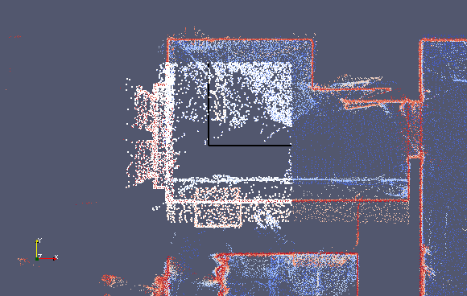 |xMin : -1.0   xMax : 1.0    yMin : -1.0   yMax : 1.0   zMin : -1.0   zMax : 2.0   removeInside : 0 |

|Figure: Top down view of the appartment point cloud with a box filter applied.  The  input is shown in color and the output of the filter is overlaid in white   |Parameters used   |
|---|:---|
|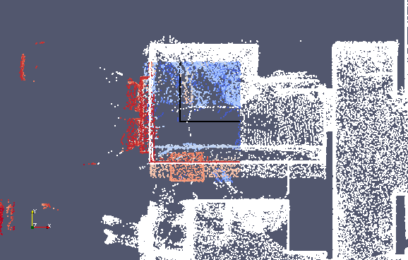 | xMin : -1.0   xMax : 1.0    yMin : -1.0   yMax : 1.0   zMin : -1.0   zMax : 2.0   removeInside : 1 |

## Maximum Density Filter 
### Description
A number of filters are used to reduce the number of points in a cloud by randomly sub-sampling or randomly rejecting a set of points.  Points in regions of high density often contain redundant information, and the ICP algorithm could be performed more efficiently with a smaller number of points.  This filter is thus used to homogenize the density of a point cloud by rejecting a sub-sample of points in high-density regions.

Points are only considered for rejection if they exceed a density threshold, otherwise they are preserved.  The single parameter of this filter sets the maximum density that should be obtained in the output point cloud.  Points are randomly rejected such that this maximum density is obtained as closely as possible.  

__Required descriptors:__ `densities` (see SurfaceNormalDataPointsFilter and SamplingSurfaceNormalDataPointsFilter)   
__Output descriptor:__ none  
__Sensor assumed to be at the origin:__ no  
__Impact on the number of points:__ reduces number of points  

|Parameter  |Description  |Default value    |Allowable range|
|---------  |:---------|:----------------|:--------------|
|maxDensity |The desired maximum density of points in *points/m^3 (for 3D), points/m^2 (for 2D)* | 10 | min: 0.0000001, max: inf|   

### Example
In the following example we observe the effect of the maximum density filter on the apartment point cloud.  Sub-sampling occurs mostly in high density regions, which colored in red in the image below.  The result is an image with lower density overall with the low density regions in blue being preserved.

|Figure: Max density filter applied to subsection of the apartment dataset.  On the  original data, low density regions are blue and high density regions are red.  The  sampled points are overlaid in white.   | Parameters used |
|---|:---| 
|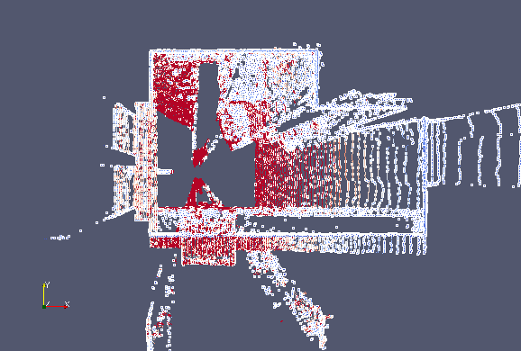 | maxDensity: 50000 |

## Maximum Distance Filter (**deprecated**) 

**Deprecated** : please consider switching to [Distance Limit Filter](#distancelimithead).

### Description
These filters remove points which lie beyond a threshold distance from the coordinate center.  Points are kept if their distance from the center is **smaller than** the threshold.  The distance threshold can be defined on the x,y, and z axes or can be a radial distance from the center.

__Required descriptors:__ none   
__Output descriptor:__ none  
__Sensor assumed to be at the origin:__ no  
__Impact on the number of points:__ reduces number of points  

|Parameter  |Description  |Default value    |Allowable range|
|---------  |:---------|:----------------|:--------------|
|dim        | Dimension over which the distance is thresholded.  If -1, then the threshold is a radial distance from the center | -1 | 0: x, 1: y, 2: z, -1: radial|
|maxDist |Distance threshold (in m) beyond which points are rejected | 1.0 | min: -inf, max: inf|

### Example
In the following example, a maximum distance threshold of 1m is applied radially by setting the dimension parameter to -1.  As shown on the image below, points which lie within a sphere of radius 1m centered at the origin are selected by the filter and are displayed in white.  All other points are rejected by the filter.  Were a maximum distance filter to be replaced by an equivalent minimum distance filter, only points outside the sphere would be selected. 

|Figure: Max density filter applied to subsection of the apartment dataset.  On the  original data, low density regions are blue and high density regions are red.  The  sampled points are overlaid in white.   | Parameters used |
|---|:---|
| | maxDist : 1.0   dim : -1 |

## Minimum Distance Filter (**deprecated**) 

**Deprecated** : please consider switching to [Distance Limit Filter](#distancelimithead).

### Description
These filters remove points which lie beyond a threshold distance from the coordinate center.  Points are kept if their distance from the center is **greater than** the threshold.  The distance threshold can be defined on the x,y, and z axes or can be a radial distance from the center.

__Required descriptors:__ none   
__Output descriptor:__ none  
__Sensor assumed to be at the origin:__ no  
__Impact on the number of points:__ reduces number of points  

|Parameter  |Description  |Default value    |Allowable range|
|---------  |:---------|:----------------|:--------------|
|dim        | Dimension over which the distance is thresholded.  If -1, then the threshold is a radial distance from the center | -1 | 0: x, 1: y, 2: z, -1: radial|
|minDist |Distance threshold (in m) beyond which points are selected | 1.0 | min: -inf, max: inf|

## Distance Limit Filter 
### Description
These filters remove points which lie before or beyond a threshold distance from the coordinate center. The distance threshold can be defined on the x,y, and z axes or can be a radial distance from the center.

__Required descriptors:__ none  
__Output descriptor:__ none  
__Sensor assumed to be at the origin:__ no  
__Impact on the number of points:__ reduces number of points  

|Parameter   |Description  |Default value    |Allowable range|
|---------   |:---------|:----------------|:--------------|
|dim         |Dimension over which the distance is thresholded.  If -1, then the threshold is a radial distance from the center | -1 | 0: x, 1: y, 2: z, -1: radial|
|dist        |Distance threshold (in m) used to reject points | 1.0 | min: -inf, max: inf|
|removeInside|If set to 1, points contained before the limit are removed, else points beyond are removed  |1   | 0 or 1|

### Example
In the following example, a distance threshold of 1m is applied radially by setting the dimension parameter to -1. Also, the removeInside parameter is set to 0 in order to remove points beyond the distance limit. As shown on the image below, points which lie within a sphere of radius 1m centered at the origin are selected by the filter and are displayed in white.  All other points are rejected by the filter.  Were the removeInside parameter value to be replaced by 1, only points outside the sphere would be selected. 

|Figure: Distance limit filter applied to subsection of the apartment dataset. On the  original data, low density regions are blue and high density regions are red. The  sampled points are overlaid in white.   | Parameters used |
|---|:---|
|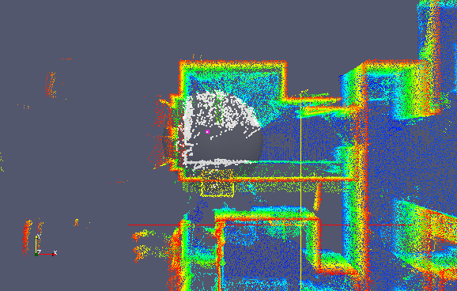 | dist : 1.0   dim : -1   removeInside : 0 |

## Maximum Point Count Filter 
### Description
Conditional subsampling. This filter reduces the size of the point cloud by randomly dropping points if their number is above `maxCount`. The resulting point cloud while have `maxCount` number of point. the Based on:  Registration and integration of multiple range images for 3-D model construction. Masuda, T. and Sakaue, K. and Yokoya, N. In Pattern Recognition, 1996., Proceedings of the 13th International Conference on. 879--883. 1996.

__Required descriptors:__ none   
__Output descriptor:__ none  
__Sensor assumed to be at the origin:__ no  
__Impact on the number of points:__ reduces number of points  

|Parameter  |Description  |Default value    |Allowable range|
|---------  |:---------|:----------------|:--------------|
|seed        | srand seed | 0 | min: 0 max: 2147483647 |
|maxCount |number of points beyond which subsampling occurs | 1000 | min: 0, max: 2147483647|

### Example
No example available.

## Maximum Quantile on Axis Filter 
### Description
Points are filtered according to where they lie on a distribution of their positions along a given axis.  The entire distance range is divided into quantiles which lie between 0 and 1.  One can specify the distance quantile above which points are rejected by the filter.

__Required descriptors:__ none   
__Output descriptor:__ none  
__Sensor assumed to be at the origin:__ no  
__Impact on the number of points:__ reduces number of points  

|Parameter  |Description  |Default value    |Allowable range|
|---------  |:---------|:----------------|:--------------|
|dim        | Dimension over which the distance (from the center) is thresholded | 0 | x:0 y:1 z:2 |
|ratio |Quantile threshold.  Points whose distance exceed this threshold are rejected by the filter | 0.5 | min: 0.0000001, max: 0.9999999 | 

### Example
In the following example, maximum quantile filtering is performed over the x-axis with a quantile threshold of 0.5.  Therefore, points which have an x-value which exceeds the 50% quantile are rejected.  The output of the filter is displayed in white and overlaid with the input point cloud in the image below.  A sampling region centered at the origin and extending in both directions of the x-axis is clearly visible.

|Figure: Maximum quantile on axis filter in the x-direction with a maximum quantile  of 0.5.   | Parameters used |
|---|:---|  
|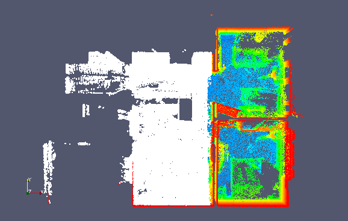 | dim : 0   ratio : 0.5 |

## Random Sampling Filter 

### Description
This filter behaves similarly to the [Maximum Point Count Filter](#maxpointcounthead) but does not enforce a maximum point constraint.  Instead points are kept by the filter with a fixed probability.

__Required descriptors:__ none   
__Output descriptor:__ none  
__Sensor assumed to be at the origin:__ no  
__Impact on the number of points:__ reduces number of points  

|Parameter  |Description  |Default value    |Allowable range|
|---------  |:---------|:----------------|:--------------|
|prob        | Probability that a point is kept (1/decimation factor) | 0.75 | min: 0, max: 1 |

### Example
In the following sample, points are kept with a probability of 0.1.  Therefore the total number of points in the output point cloud is approximately 10 times less than the number of points in the input point cloud and the density is decreased overall.

|Figure:  After applying the random sampling filter with a probability of 0.1.   The original data is shown in black and the sampled points in white.   | Parameters used |
|---|:---|  
| | prob : 0.1 |

## Remove NaN Filter 

### Description
Due to errors in the capture process point clouds may contain points with invalid coordinates.  This filter can be applied to remove points which contain a NaN coordinate, thus producing a "clean" dataset.

__Required descriptors:__ none   
__Output descriptor:__ none  
__Sensor assumed to be at the origin:__ no  
__Impact on the number of points:__ reduces number of points  

## Shadow Point Filter 

### Description

Shadow points are noisy points usually located at point cloud edge discontinuities.

__Required descriptors:__  `normals`  (see SurfaceNormalDataPointsFilter)
__Output descriptor:__ none  
__Sensor assumed to be at the origin:__ no  
__Impact on the number of points:__ reduces number of points  

*IMPORTANT:* The surface normal descriptors are required in the input point cloud. 

## Voxel Grid Filter (**deprecated**) 

**Deprecated** : please, due to unefficient memory usage, consider switching to [Octree Grid filter](#octreegridhead).

### Description
While, the previous filters were sub-sampling filters in that they returned a sub-set of points from the original point cloud, the voxel grid filter instead returns a point cloud with a smaller number of points which should best represent the input point cloud as a whole.

The voxel grid filter down-samples the data by taking a spatial average of the points in the cloud.  In the 2D case, one can simply imagine dividing the plane into a regular grid of rectangles.  While the term is more suited to 3D spaces, these rectangular areas are known as *voxels*.  The sub-sampling rate is adjusted by setting the voxel size along each dimension.  The set of points which lie within the bounds of a voxel are assigned to that voxel and will be combined into one output point.

There are two options as to how to represent the distribution of points in a voxel by a single point.  In the first, we take the centroid or spatial average of the point distribution.  In the second, we simply take the geometrical center of the voxel.  Clearly, the first option is more accurate since it takes into account the point distribution inside the voxels.  However it is more computationally intensive since the centroid must be computed for each voxel.  The computational cost increases linearly with the number of points in the cloud and the number of voxels.

This filter also provides two methods for sub-sampling descriptors.  In the first, all descriptors within a voxel are averaged while in the second, only the first descriptor from a voxel is kept.

__Required descriptors:__  none  
__Output descriptor:__ outputs average or single descriptor per voxel if the input cloud contains descriptors  
__Sensor assumed to be at the origin:__ no  
__Impact on the number of points:__ reduces number of points  

|Parameter  |Description  |Default value    |Allowable range|
|---------  |:---------|:----------------|:--------------|
|vSizeX     |Size of the voxel along the x-axis | 1.0 | ]0 ; +inf[|
|vSizeY     |Size of the voxel along the y-axis | 1.0 | ]0 ; +inf[|
|vSizeZ     |Size of the voxel along the z-axis | 1.0 | ]0 ; +inf[|
|useCentroid|If 1, down-sample by using the centroid of each voxel.  If 0, use the voxel center | 1 | 1 or 0|
|averageExistingDescriptors|If 1, descriptors are down-sampled by taking their average in the voxel.  If 0, we use the descriptors from the first point found in the voxel | 1 | 1 or 0|

For more information on the implementation of this filter, refer to [this tutorial](DataPointsFilterDev.md).

### Example
In this example, we apply the voxel grid filter using centroid down-sampling to the appartment point cloud.  The output points are shown in yellow.  You can observe a regular grid distribution of points corresponding to each voxel.  A finer degree of sub-sampling can be obtained by using smaller voxels.  This comes naturally with an increased computational cost and a larger output point cloud.

|Figure:  Applying the voxel grid filter filter to the appartment point cloud. | Parameters used |
|---|:---|  
|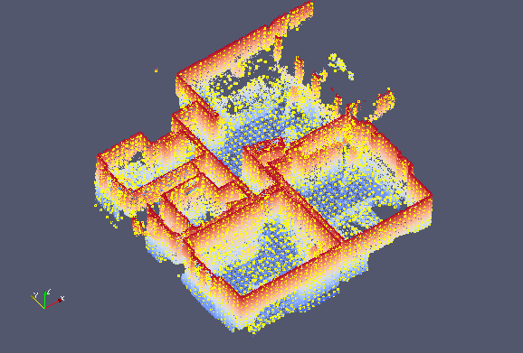 | vSizeX : 0.2   vSizeY : 0.2   vSizeZ : 0,2   useCentroid : 1 |

## Octree Grid Filter 

### Description

The concept is quite the same as the voxel grid but use an [Octree](https://en.wikipedia.org/wiki/Octree) (3D case) or a [Quadtree](https://en.wikipedia.org/wiki/Quadtree) (2D case). The filter use the efficent spatial representation of the pointcloud by the octree to sub-sample point in each leaf.

Some information about the octree structure:
- the current implementation ensures to have either 0 or 8 (resp. 4) children for each node of the octree (resp. quadtree)
- only leaf nodes contain data
- data contained by the octree are currently the indexes of the points from the `DataPoint` structure
- processing are applied by calling a callback for each node in a depth-first search ([DFS](https://en.wikipedia.org/wiki/Depth-first_search))
- parallel build can be enabled (but only the first level is parallelized)
- the octree can be build given two criterion: number of data by leaf node, or size of the leaf node

**Remark 1:** currently the space is decomposed from the Cartesian coordinates (x,y,z), but there should be no limitation to use other dimensions (such as normal coordinates for instance).

With this new structure, the `DataPointsFilter` named `OctreeGridDataPointsFilter` works as follow:
- build an octree spatial representation of the point cloud
- apply a process to sample in each leaf node

Four sampling methods are available:
- take the first point of each node (`FirstPtsSampler`)
- take a random point of each node (_quite similar to the previous one since the point cloud is not supposed to be ordered_) (`RandomPtsSampler`)
- compute [centroid](https://en.wikipedia.org/wiki/Centroid) of each node (_more precise but more costly_) (`CentroidSampler`)
- compute [medoid](https://en.wikipedia.org/wiki/Medoid) of each node (_more precise but more costly_) (`MedoidSampler`)

**Remark 2:** Theoretically, any process can be applied to the point cloud (sampling, feature enhancement, filtering, etc.) since the octree give an efficient spatial representation of the point cloud (_ex: we could estimate the normal of each leaf_).

__Required descriptors:__  none  
__Output descriptor:__ none  
__Sensor assumed to be at the origin:__ no  
__Impact on the number of points:__ reduces number of points  

|Parameter  |Description  |Default value    |Allowable range|
|---------  |:---------|:----------------|:--------------|
|buildParallel	| flag for enabling parallel build of the octree | true (1) | 0 or 1 |
|maxPointByNode	| number of point under which the octree stop dividing | 1 | min: 1, max: 4294967295 |
|maxSizeByNode	| size of the bounding box under which the octree stop dividing | 0.0 | min: 0.0, max: +inf |
|samplingMethod	| method to sample the octree: First Point (0), Random (1), Centroid (2) (more accurate but costly), Medoid (3) (more accurate but costly) | 0 | min: 0, max: 3 |

### Example
The following example uses a structured point cloud from the apartment dataset. As the pointcloud is structured we use the size criterion set to 20 cm to decompose the point cloud. In each leaf, we took the _centroid_ (bottom) or the _medoid_ (top) colored in green (output points), where the color of the pointcloud represents the indexes in the octree.

|Figure:  Applying the Octree Grid Filter on a structured point cloud  | Parameters used |
|---|:---|  
| | maxSizeByNode : 0.2   _at the top_, samplingMethod : 3 (_medoid_)   _at the bottom_, samplingMethod : 2 (_centroid_)|

**Remark 3:** using centroid can lead to false results in the ICP registration. In deed, the centroid is not guaranteed to be a point of the cloud, which induce a new spatial representation and so an offset in the registration, whereas the medoid is by construction a point of the cloud. Both produce a similar sampled point cloud, but looking closer we can see that:
- In the top-right corner, sampled points are contained in the original point cloud
- In the bottom-right corner, sampled points are out of the point cloud.

## Normal Space Sampling Filter 

### Description

Sub-sampling filter based on Normal Space Sampling (NSS) from _S. Rusinkiewicz and M. Levoy, “Efficient Variants of the ICP Algorithm,” in Proceedings Third International Conference on 3-D Digital Imaging and Modeling, 2001, pp. 145–152_. 

The algorithm works as follow:
1. Construct a set of buckets in the normal-space (stocked in a `std::vector`) 
1. Then put all points of the data into buckets based on their normal direction; 
1. Finally, uniformly pick points from all the buckets until the desired number of points is selected.

**Remark:** a point is randomly picked in a bucket that contains multiple points.  
**Remark:** the uniform sampling is based on a standard Mersenne twister engine

As the normals are supposed normed, the _n_-space can be represented by polar coordinates, with:
- _theta_, the polar angle in [0 ; pi]
- _phi_, the azimuthal angle in [0 ; 2pi]
- _r_=1, the radius can be omitted

Resources to better understand uniform sampling in normal-space can be found [here](http://corysimon.github.io/articles/uniformdistn-on-sphere/).

**Remark:** the current implementation only supports 3D point cloud  

__Required descriptors:__  `normals` (see SurfaceNormalDataPointsFilter)  
__Output descriptor:__ none  
__Sensor assumed to be at the origin:__ no  
__Impact on the number of points:__ reduces number of points  
	
|Parameter  |Description  |Default value    |Allowable range|
|---------  |:---------|:----------------|:--------------|
|nbSample	| number of point to select | 5000 | min: 1, max: 4294967295|
|seed	| seed for the random generator | 1 | min: 0, max: 4294967295 |
|epsilon	| step of discretization for the angle spaces | PI/32 | min: PI/64, max: PI |

### Example
The following example uses a structured point cloud from the apartment dataset. The following gives the normal representation (on a sphere) of the original point cloud (we can clearly see that some areas are more populated) and the normal representation of the uniform sampled pointcloud (output). 

|Figure: Applying the NSS Filter on a structured point cloud | Parameters used |
|---|:---|  
| | nbSample : 5000   seed : 1   epsilon : PI/32 |

where the left-white point cloud is the normal distribution of the original point cloud,
where the right-red point cloud is the normal distribution of the sampled point cloud

## Covariance Sampling Filter 

### Description

Sub-sampling filter based on Covariance Sampling (CovS) from _N. Gelfand, L. Ikemoto, S. Rusinkiewicz, and M. Levoy, “Geometrically stable sampling for the ICP algorithm,” in Fourth International Conference on 3-D Digital Imaging and Modeling, 2003. 3DIM 2003. Proceedings., 2003, pp. 260–267._ 

The filter analyses the force (_t-normals_: **n**) and the torque (_r-normals_: **n x p**) to select geometrically stable points that can bind the rotational components as well as the translational. Unlike the original article, we match the point-cloud with itself (considering then an overlap of 100%).

Three methods can be used to balance rotation and translation through torque normalization (L):
- L=1 (no normalization): more _t-normals_
- L=Lavg (average distance to centroid) : same contribution for _t-normals_ and _r-normals_ as torque is scale-independent
- L=Lmax (in unit ball): more _r-normals_

__Required descriptors:__  `normals` (see SurfaceNormalDataPointsFilter)  
__Output descriptor:__ none  
__Sensor assumed to be at the origin:__ no  
__Impact on the number of points:__ reduces number of points  
	
|Parameter  |Description  |Default value    |Allowable range|
|---------  |:---------|:----------------|:--------------|
|nbSample	| number of point to select | 5000 | min: 1, max: 4294967295|
|torqueNorm	| method for torque normalization: (0) L=1, (1) L=Lavg, (2) L=Lmax | 1 | min: 0, max: 2 |

### Example
The following example uses a structured point cloud from the apartment dataset. The following gives the selected points (output) considering the three proposed normalization methods (L=1 in blue, L=Lavg in yellow and L=Lmax in red).

|Figure: Applying the CovS Filter on a structured point cloud | Parameters used |
|---|:---|  
| | nbSample : 25000   torqueNorm :   0 (blue)   1 (yellow)   2 (red) |

**Remark:** the filter is not very well suited for large scan with uneven density, it is preferably to use it for computer vision applications, or small scan.

## Observation Direction Filter 

### Description
As opposed to the previous filters, the following does not yield a sub-sample of points but rather augments the input point cloud with additional information.  In particular, this filter adds a descriptor vector to each point representing its direction to the sensor used for capturing the point cloud.  Remark that adding a direction vector is useful for locally captured point clouds in which the position of the sensor is fixed.  In contrast global point clouds which are formed from several local point clouds do not have a fixed sensor position.

The returned direction vector is a vector connecting the point and the sensor, whose positions can be specified in the filter parameters.

__Required descriptors:__   none  
__Output descriptor:__ `observationDirections`  
__Sensor assumed to be at the origin:__ yes    
__Impact on the number of points:__ none  

|Parameter  |Description  |Default value    |Allowable range|
|---------  |:---------|:----------------|:--------------|
|x       | x-coordinate of the sensor position | 0.0 | min: -inf, max: inf |
|y       | y-coordinate of the sensor position | 0.0 | min: -inf, max: inf |
|z       | z-coordinate of the sensor position | 0.0 | min: -inf, max: inf |

### Example
**Remark:** The following example uses a local point cloud 10 from the apartment dataset.  The filter is used to extract direction informations and a small subset of these directions is shown in the following image.  The arrows point towards the position of the sensor.  The input point cloud is color coded according to the z-elevation of the points (red represents the ceiling and blue the floor).

|Figure:  Applying the observation direction filter to a local point cloud.  A small  subset of point observation directions are displayed   | Parameters used |
|---|:---|  
|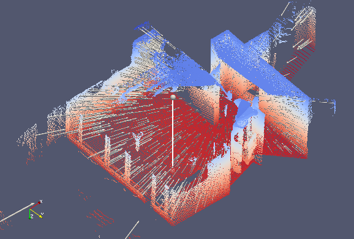 | x : 0   y : 0   z : 0 |

## Surface Normal Filter 

### Description
The surface normal to each point is estimated by finding a number of neighboring points and taking the eigen-vector corresponding to the smallest eigen-value of all neighboring points.

Remark that that given a surface, the normal vector can point in two possible directions.  Following the apartment example used herein throughout, the normal vector of a wall can point inside towards the room, or outside the apartment.  To align all normal vectors in the same direction, the [orient normals filter](#orientnormalshead) can be used.

__Required descriptors:__ none   
__Output descriptor:__   
`normals`  
`densities`  
`eigValues`  
`eigVectors`  
__Sensor assumed to be at the origin:__ no  
__Impact on the number of points:__ none  

|Parameter  |Description  |Default value    |Allowable range|
|---------  |:---------|:----------------|:--------------|
|knn       | Number of neighboring points (including the point itself) to consider when extracting surface normal | 5 | min: 3, max: 2147483647 |
|epsilon       | Approximation used in nearest neighbor search | 0.0 | min: 0.0, max: inf |
|keepNormals       | Add the normal vector to descriptors | 1 | 1: true, 0: false |
|keepDensities     | Add point cloud density to descriptors | 0 | 1: true, 0: false |
|keepEigenValues   | Add eigen values to descriptors    | 0 | 1: true, 0: false |
|keepEigenVectors   | Add eigen vectors to descriptors    | 0 | 1: true, 0: false |
|keepMatchedIds   | Add identifiers of matched points to descriptors (see)    | 0 | 1: true, 0:false |

### Example
In this example, we again use a local point cloud of the apartment. You may recognize the input point cloud as a small portion of the local cloud used in the observation direction filter.  The surface normals are extracted using 20 neighboring points and epsilon=0.  In this example, for clarity, we only view a wall section of one of the apartment dataset.  A random set of normal vectors is shown in the figure with arrows.  When looking at the arrow directions on the wall, one may see normal vectors either pointing downwards into the apartment or outside the apartment.

|Figure:  Applying the observation direction filter to a local point cloud.  A small  subset of point observation directions are displayed   | Parameters used |
|---|:---|  
|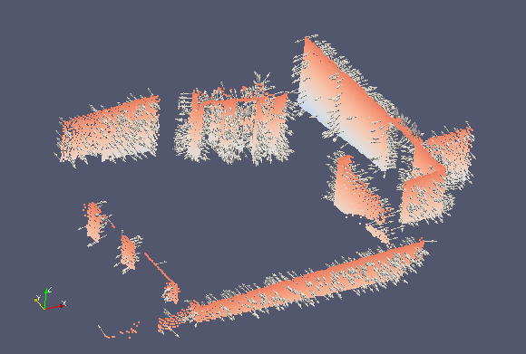 | knn : 20   epsilon : 0   keepNormals : 1   keepDensities : 1|

## Orient Normals Filter 

### Description
As explained previously, neighboring surface normal vectors obtained from the surface normals filter, do not have the same orientation.  This filter enforces this constraint and reorients vectors from the same surface in a consistent direction.  Vectors are reoriented to either point towards the center (inwards), or away from the center (outwards).

__Required descriptors:__  
  `observationDirections` (see ObservationDirectionDataPointsFilter)   
  `normals` (see SurfaceNormalDataPointsFilter, SamplingSurfaceNormalDataPointsFilter)      
__Output descriptor:__ none  
__Sensor assumed to be at the origin:__ yes  
__Impact on the number of points:__ none 

|Parameter  |Description  |Default value    |Allowable range|
|---------  |:---------|:----------------|:--------------|
|towardCenter     | Orient vectors to point towards the center | 1 | 1: true, 0: false |

*IMPORTANT:* Both the normal vector descriptor and observation direction descriptors must be present in the input point cloud.  Consequently, both the surface normal and observation filters should be applied prior to using this filter.

### Example
The same input section is used as for extracting the surface normals in the previous section.  The vectors are reoriented to point towards the center which lies in the bottom left corner of the image below.  We now observe that adjacent surface normal vectors point in a consistent direction.

|Figure:  Normal vectors reoriented to point towards the center   |Parameters used   |
|---|:---|
|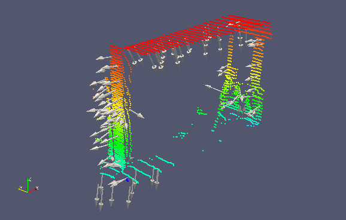 |towardCenter: 1 |

## Sampling Surface Normal Filter 

### Description
The above filters extract surface normals at every point in the point cloud.  In point clouds representing planar surfaces however, a significant redundant information is contained in adjacent normal vectors.  This filter attempts to both reduce the number of points within a point cloud and the number of different normal vectors.  The first is achieved by performing either random sub-sampling as seen previously, or by using one point per box (bin sub-sampling).  The latter is achieved by recursively decomposing the point-cloud space into boxes until each box contains at most knn points.  A single normal vector is computed from the knn points in each box.

__Required descriptors:__  none  
__Output descriptor:__ 
`normals`   
`densities`  
`eigValues`   
`eigVectors`  
__Sensor assumed to be at the origin:__ yes   
__Impact on the number of points:__ reduces number of points

|Parameter  |Description  |Default value    |Allowable range|
|---------  |:---------|:----------------|:--------------|
|ratio     | Ratio of points (sampled randomly) that are preserved within a box | 0.5 | min: 0.0000001, max: 0.9999999 |
|knn       | Number of points contained within a box and number of neighboring points (including the point itself) to consider when extracting surface normal | 7 | min: 3, max: 2147483647 |
|samplingMethod       | 0: random sub-sampling   1:bin sub-sampling with resulting number of points 1/knn | 0 | 0 or 1 |
|maxBoxDim| Maximum allowed length of a box above with boxes are discarded | inf | min: 0.0000001, max: inf |
|averageExistingDescriptors | Average existing descriptors within a box or keep existing values | 1 | 0: keep existing 1: average existing|
|keepNormals       | Add the normal vector to descriptors | 1 | 1: true, 0: false |
|keepDensities     | Add point cloud density to descriptors | 0 | 1: true, 0: false |
|keepEigenValues   | Add eigen values to descriptors    | 0 | 1: true, 0: false |
|keepEigenVectors   | Add eigen vectors to descriptors    | 0 | 1: true, 0: false |
|keepMatchedIds   | Add identifiers of matched points to descriptors (see)    | 0 | 1: true, 0: false |

### Example
We reuse the same apartment section to illustrate the sampling of normal vectors.  The decimation rate used is 0.5 such that half of the points from the original point cloud are discarded randomly.  We use a knn value of 100 such that each box contains at most 100 points.  In the following two figures, we extract sample points based on the normals and display the normal vectors at these sample points. We first do so for a ceiling section, followed by a ground section.  Because the ceiling is essentially a large plane, the sampling is low and the normal vector arrows are dispersed relatively equally as shown in the first figure.  On the other hand, the ground section has a higher density of points.  This results in a denser sampling of points which is seen in the second figure.

  The box centers are shown in red on the following picture.  It is clear that as opposed to previous filters, adjacent points within a box have the same normal vector.

|Figure:  Sampled normal vectors of ceiling section   |Parameters used   |
|---|:---|
|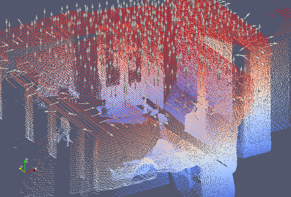 | knn : 100   ratio : 0.5   samplingMethod : 1 |

|Figure:  Sampled normal vectors ground section   |Parameters used   |
|---|:---|
| | knn : 100   ratio : 0.5   samplingMethod : 1 |

## Simple Sensor Noise Filter 

### Description
This filter is used to augment points with an estimation of position uncertainty based on sensor specifications.  So far the [SICK LMS](http://www.sick.com/group/EN/home/products/product_news/laser_measurement_systems/Pages/lms100.aspx), [Hokuyo](http://www.hokuyo-aut.jp/02sensor/index.html#scanner) URG-04LX and UTM-30LX, as well as the Microsoft [Kinect](http://www.microsoft.com/en-us/kinectforwindows/) and Asus [Xtion](http://www.asus.com/Multimedia/Xtion_PRO_LIVE/) sensors are supported.  The uncertainty or noise radius is represented in meters, and can be adjusted by varying a gain parameter which amplifies predefined uncertainty levels.

__Required descriptors:__  none  
__Output descriptor:__ `simpleSensorNoise`  
__Sensor assumed to be at the origin:__ yes  
__Impact on the number of points:__ none

|Parameter  |Description  |Default value    |Allowable range|
|---------  |:---------|:----------------|:--------------|
|sensorType | The type of sensor that was used in the capture.   0: Sick LMS-1xx  1: Hokuyo URG-04LX   2 : Hokuyo UTM-30LX   3 : Kinect/Xtion | 0 |  0, 1, 2, or 3|
|gain       | Used to augment uncertainty | 1 | min: 1, max: inf|

### Example
For this example we use another point cloud dataset from the ASL collection called [ETH Hauptgebaude](http://projects.asl.ethz.ch/datasets/doku.php?id=laserregistration:eth_hauptgebaude:home).  This dataset represents the main gallery of the main building at ETHZ and presents long straight corridors.  We therefore use to display the uncertainty estimation of point clouds.

In the following image we show a side view of local point cloud 3 in the dataset.  The laser is located at the bottom left corner and one can see the long arched corridor structures.  As we move right in the image point are located further away from the sensor, are therefore less numerous and more uncertain.  The points are colored by the estimation uncertainty obtained with this filter.  More certain points are black, medium certain points are red and less curtain points are white.  Naturally the colour shifts from black to white as we move further away from the laser down the corridor.

|Figure:  Side view of a view 3 from the HG dataset augmented with sensor noise  estimations   |Parameters used   |
|---|:---|
|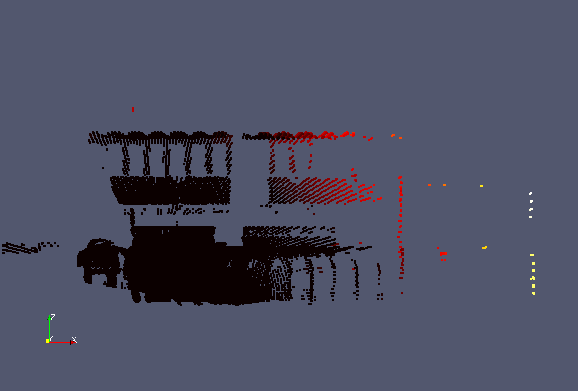 | sensorType : 1 |

## Fixed Step Sampling Filter (To be completed)
The number of points in a point cloud can be reduced by taking random point subsamples.  The filter is parametrized so that a fixed number of points - selected uniformly at random - are 'rejected' in the filtering process.

## Where To Go From Here
This concludes the overview of data point filters.  For a tutorial on writing a simple application for applying data point filters to an input point cloud, go [here](ApplyingDatafilters.md).  To learn more about the general configuration of the ICP chain go [here](DefaultICPConfig.md).  

