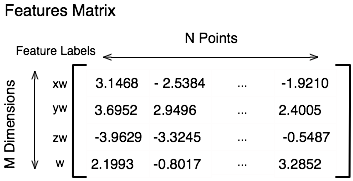
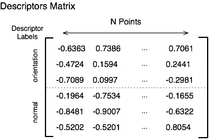

| [Tutorials Home](index.md)    | [Previous](UsingInRos.md) | [Next](Transformations.md) |
| ------------- |:-------------:| -----:|

# Point Clouds in Libpointmatcher

The base structure containing library functionality is called `PointMatcher`.  It is restricted to a particular scalar type T through the use of a template: `PointMatcher<T>`.  In almost all situations the type T will either be `double` or `float` and provides developers with the flexibility of choosing which best suits their application.  For simplicity, we recommend using an abbreviated type identifier for `PointMatcher`.  This could for example be the following:
```cpp
typedef PointMatcher<float> PM;
``` 

In libpointmatcher, point clouds are encapsulated in `DataPoints` objects.  DataPoints objects are composed of the following members :

* Features matrix
* Feature Labels
* Descriptors matrix
* Descriptor Labels 

### Features Matrix
Features is an [Eigen matrix](http://eigen.tuxfamily.org/dox/classEigen_1_1Matrix.html) typically containing the coordinates of the points which form the cloud.  Each column corresponds to a point in the cloud.  The rows correspond to the dimensions of the points in homogeneous coordinates.  Homogeneous coordinates are used to allow for translations and rotations.  For 2D point clouds, there will thus be 3 rows and for 4 rows for 3D point clouds.

 

### Feature Labels
Each row of the features matrix can be given a human readable label such as ¨X¨,¨Y¨, or ¨Z¨ and the group of labels is stored as a vector.

### Descriptors
Descriptors are additional information about each point in the cloud.  For example these may include an orientation vector pointing to the sensor location, or a surface normal vector.  Following the structure of the features matrix, descriptors are stored in a single Eigen matrix with each column representing a point in the cloud.  Descriptors are stacked in the rows of the features matrix and thus a single descriptors will span several rows.



### Descriptor Labels
Human readable labels are used to identify the individual descriptors in the descriptors matrix.  For example if the point cloud contains a 3D orientation and 3D surface normal descriptors for each points we may assign the label: "orientation" to the first three rows of the descriptor matrix and the label "normal" to the last three.
