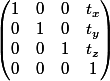

| [Tutorials Home](Tutorials.md)    | [Previous](DataPointsFilterDev.md) | [Next](UnitTestDev.md) |
| ------------- |:-------------:| -----:|

# Extending libpointmatcher Transformations

## Defining your own Transformation Class
While rigid transformations cover most of the geometric transformations that are used in point cloud registration, we may be interested in defining our own transformations.  In that case we will have to define our own class to represent it and derive this class from the `Transformation` interface class.  

Suppose we are interested in defining a transformation type that only includes 3D translations.  For that, we require that the transformation matrix have the following form.

|**Figure 4:** A 3D transformation matrix representing a pure translation |
|:---|
||

We will name our new transformation class `PureTranslation`.  The `Transformation` interface requires us to define three pure virtual functions: `compute`, `checkParameters`, and `correctParameters`.  The class declaration for `PureTranslation` is as follows:

```cpp
template<typename T>
class PureTranslation : public PointMatcher<T>::Transformation {

	typedef PointMatcher<T> PM;
	typedef typename PM::Transformation Transformation;
	typedef typename PM::DataPoints DataPoints;
	typedef typename PM::TransformationParameters TransformationParameters;

public:
	virtual DataPoints compute(const DataPoints& input, const TransformationParameters& parameters) const;
	virtual bool checkParameters(const TransformationParameters& parameters) const;
	virtual TransformationParameters correctParameters(const TransformationParameters& parameters) const;
};
```

We first implement the `checkParameters` function whose purpose is to determine if the transformation parameters match the type of transformation that is to be performed.  In our case, we wish to check that the transformation represented in the transformation matrix is indeed a pure translation.  This translates to checking that subtracting the rightmost column while ignoring the bottom row from the transformation matrix returns an identity matrix.

```cpp
template<typename T>
inline bool PureTranslation<T>::checkParameters(
		const TransformationParameters& parameters) const {
	const int rows = parameters.rows();
	const int cols = parameters.cols();

	// make a copy of parameters to perform the check
	TransformationParameters parameters_(parameters);

	// set the translation components of the transformation matrix to 0
	parameters_.block(0,cols-1,rows-1,1).setZero();

	// If we have the identity matrix, than this is indeed a pure translation
	if (parameters_.isApprox(TransformationParameters::Identity(rows,cols)))
		return true;
	else
		return false;
}
```

Next, we implement the `correctParameters` function to create a pure translation from a regular transformation.  In other words, we set the transformation matrix to the identity matrix and add the translation components.

```cpp
template<typename T>
inline typename PureTranslation<T>::TransformationParameters PureTranslation<T>::correctParameters(
		const TransformationParameters& parameters) const {
	const int rows = parameters.rows();
	const int cols = parameters.cols();

	// make a copy of the parameters to perform corrections on
	TransformationParameters correctedParameters(parameters);

	// set the top left block to the identity matrix
	correctedParameters.block(0,0,rows-1,cols-1).setIdentity();

	// fix the bottom row
	correctedParameters.block(rows-1,0,1,cols-1).setZero();
	correctedParameters(rows-1,cols-1) = 1;

	return correctedParameters;
}
``` 
Now that we have properly defined our transformation object representing pure translations, we can use it in our code.  We modify the code from the previous example to use our `PureTranslation` object.  Running this code should produce the same results as in the previous case.

```cpp
int main(int argc, char *argv[]) {
	if (argc != 3) {
		std::cerr << "Error: invalid number of arguments" << std::endl;
	}

	PM::TransformationParameters T;
	T = PM::TransformationParameters::Identity(4,4);

	// Applying a translation in the x direction
	T(0,3) = 50;

	std::cout << "Transformation Matrix: " << std::endl << T << std::endl;

	PureTranslation<float> translation;
	//translation = PM::get().REG(Transformation).create("RigidTransformation");

	if (!translation.checkParameters(T)) {
		std::cout << "WARNING: T does not represent a valid rigid transformation\nProjecting onto an orthogonal basis"
				<< std::endl;
		T = translation.correctParameters(T);
	}

	// Load a point cloud from a file
	PM::DataPoints pointCloud;
	std::string inputFile = argv[1];
	pointCloud = PM::DataPoints::load(inputFile);

	// Compute the transformation
	PM::DataPoints outputCloud =  translation.compute(pointCloud,T);

	outputCloud.save(argv[2]);

	std::cout << "Transformed cloud saved to " << argv[2] << std::endl;
	return 0;
}
```
## Making a Custom Transformation a libpointmatcher Module
Suppose we have defined a useful transformation that we wish to add to libpointmatcher for future use.  We can as an example make a new libpointmatcher module out of the `PureTranslation` transformation class we just designed.

Transformation modules live in the `pointmatcher/TransformationsImpl.h` and implemented in the cpp file of the same name.  Before copying in our `PureTranslation` class declaration, we will add to it an additional function. The `description` function should return some useful information about the transformation such as its name, requirements, and possible parameters that are used in the transformation.

```cpp
inline static const std::string description()
	{
		return "Pure translation transformation\nA rigid transformation with no rotation.";
	}
```

After adding the class to `TransformationsImpl`, we will add it to the registry as a libpointmatcher module.  We do so by adding the following macro in [pointmatcher/Registry.cpp](/pointmatcher/Registry.cpp)

```cpp
ADD_TO_REGISTRAR_NO_PARAM(Transformation, PureTranslation, typename TransformationsImpl<T>::PureTranslation)
```

Now recompile the library and check that the new transformation is listed as an available module by running `pcmip -l | grep -C 10 PureTranslation`.

## Where To Go From Here
We recommend you try to build your own class of transformations and register it to libpointmatcher.  The [next tutorial](UnitTestDev.md) covers how to write test cases to validate your classes.  While the tutorial covers test cases for a data filter, you should also write test cases to verify that your transformations function correctly.
