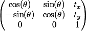
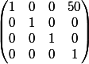
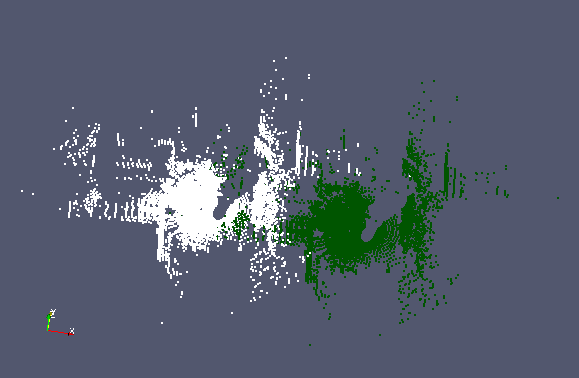

| [Tutorials Home](Tutorials.md)    | [Previous](Pointclouds.md) | [Next](DataPointsFilterDev.md) |
| ------------- |:-------------:| -----:|

# Applying Transformations to Point Clouds

The outcome of a point cloud registration is some rigid transformation which, when applied to the reading point cloud, best aligns it with the reference point cloud.  This transformation can be represented algebraically with a square matrix of the dimensions of the homogeneous point coordinates. A point cloud is transformed by left-multiplying it by the transformation matrix.

In libpointmatcher, transformations are encapsulated in a `TransformationParameters` object, which is itself simply an Eigen matrix.

### Example: Applying a Translation

#### Creating a Rigid Transformation Object  
As an example, we wish to apply a simple translation to all points in a specified point cloud.  A rigid transformation is one that moves the point cloud while preserving the distances between points in the cloud.  Rigid transformations can be rotations, translations, and combinations of the two, but not reflections.  A rigid transformation is parametrized by a transformation matrix in homogeneous coordinates.  Therefore for 2D transformations this is a square 3x3 matrix, and for 3D transformations a 4x4 matrix.  Because point cloud registration is concerned with finding an alignment between two point clouds, libpointmatcher provides us with a module for performing rigid transformations.

|**Figure 1:** A 2D transformation matrix representing a translation (tx,ty) and a clockwise rotation of angle theta about the origin  |
|:---|
||

In the following example we will apply a simple translation: moving each point in the point cloud by 50 meters in the x direction.  The associated transformation matrix is shown below:

|**Figure 2:** A 3D transformation matrix representing a translation of 50 units in the x direction  |
|:---|
||

We make use of the "RigidTransformation" module provided by libpointmatcher.  The `RigidTransformation` class provides several key functions. The `checkParameters` function verifies if a transformation matrix T satisfies the constraints of a rigid transformation: namely that T is orthogonal and has a determinant of 1.  The `correctParameters` function can be called if a transformation does not satisfy orthogonal constraints.  An orthogonal approximation for T will then be computed.  Finally the `compute` function applies the transformation contained in a `TransformationParameters` object.

In the following example we define a transformation by specifying the TransformationParameters object to represent a translation in the x direction.  We do so by setting the top right element of the transformation Eigen matrix to be 50, such that the point cloud will move by 50 meters in the x direction.  We apply this transformation to an input point cloud and save the output point cloud.

```cpp
int main(int argc, char *argv[]) {
	if (argc != 3) {
		std::cerr << "Error: invalid number of arguments" << std::endl;
	}

	PM::TransformationParameters T;
	T = PM::TransformationParameters::Identity(4,4);
	// Applying a translation in the x direction
	T(0,3) = 50;

	std::cout << "Transformation Matrix: " << std::endl << T << std::endl;

	PM::Transformation* rigidTrans;
	rigidTrans = PM::get().REG(Transformation).create("RigidTransformation");

	if (!rigidTrans->checkParameters(T)) {
		std::cout << "WARNING: T does not represent a valid rigid transformation\nProjecting onto an orthogonal basis"
				<< std::endl;
		T = rigidTrans->correctParameters(T);
	}

	// Load a point cloud from a file
	PM::DataPoints pointCloud;
	std::string inputFile = argv[1];
	pointCloud = PM::DataPoints::load(inputFile);

	// Compute the transformation
	PM::DataPoints outputCloud =  rigidTrans->compute(pointCloud,T);

	outputCloud.save(argv[2]);

	std::cout << "Transformed cloud saved to " << argv[2] << std::endl;
	return 0;
}
```

The output point cloud can be visualized in Paraview.  We see on the following figure that all points have been shifted by 50 meters in the x direction.
  
|**Figure 3:** Result of the transformation on `examples/data/car_cloud400.csv`.  The white points form the original point cloud, while the green points are the points which were translated.  |
|:---|
||

#### Defining your own Transformation Class
If you use some other type of transformations than rigid transformations, you may wish to create your own transformation class which may perform its own consistency checks.  Instructions on designing such a class and adding it as a module to libpointmatcher can be found in [this developer tutorial](TransformationDev.md).		   

#### Applying a Manual Transformation
We can also perform transformations by directly applying a transformation on a point cloud.  In the following example, we perform a transformation by multiplying a transformation matrix to the original point cloud.  Note that **this does not apply the transformation to associated descriptors** such as surface normals or orientation directions.  For this reason, this approach is strongly discouraged in practice.  The following example code performs the same transformation as in the previous cases:

```cpp
#include <pointmatcher/PointMatcher.h>
#include <iostream>
#include <fstream>

typedef PointMatcher<float> PM;

int main(int argc, char *argv[]) {

    if (argc != 3) {
        std::cerr << "Error: invalid number of arguments" << std::endl;
    }

	PM::TransformationParameters T;
	T = PM::TransformationParameters::Identity(4,4);
	// Applying a translation in the x direction
	T(0,3) = 50;

	std::cout << "Transformation Matrix: " << std::endl << T << std::endl;

	// Load a point cloud from a file
	PM::DataPoints pointCloud;
	std::string inputFile = argv[1];
	pointCloud = PM::DataPoints::load(inputFile);

	// Create a second point cloud of same dimension to store transformed cloud
	PM::DataPoints outputCloud = pointCloud.createSimilarEmpty();

	// Apply transformation and store in output point cloud
	outputCloud.features = T * pointCloud.features;

	outputCloud.save(argv[2]);

	std::cout << "Transformed cloud saved to " << argv[2] << std::endl;
	return 0;
}
```
