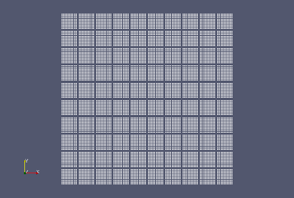

| [Tutorials Home](Tutorials.md)    | [Previous](TransformationDev.md) | [Next]() |
| ------------- |:-------------:| -----:|

# Testing libpointmatcher Modules
It is often good practice to accompany the development of new software features with the development of test cases which validate that these features are working correctly.  When developing for an open source project such as libpointmatcher, testing is crucial to maintain stability and avoid the introduction of erronous code.

Libpointmatcher uses the [C++ testing framework developed by Google](https://code.google.com/p/googletest/).  If you are not sure if you installed libpointmatcher with GTest, go to the libpointmatcher's CMake build directory and run `make test`.  If the tests do not run, refer back to the [compilation instructions](Compilation.md) to recompile with GTest.

Libpointmatcher's unit tests can be found in [utest/utest.cpp](/utest/utest.cpp).  In this tutorial, we will write a series of tests for validating the voxel grid filter developed in [this past tutorial](DataPointsFilterDev.md).  Note that this test will not cover the myriad of features that GTest provides.  Nevertheless, it is very easy to understand GTest without extensive experience.  For those who wish to have a solid introduction to GTest we recommend to start with this [this primer](http://code.google.com/p/googletest/wiki/Primer).


## A Unit Test for the Voxel Grid Filter

Data filter tests are covered by the `DataFilterTest` test cast in utest.cpp.  We define a new test unit called `VoxelGridDataPointsFilterTest` following the convention used for the other filters.  This test unit will in fact contain several tests that are detailed subsequently.

```cpp
TEST(DataFilterTest, VoxelGridDataPointsFilterTest)
```

### Test 1: 2D Case
In the following test, we create a 2D point cloud point cloud where each voxel contains a grid of unformly spaced points.  We define variables setting the number of divisions of the bounding region to form voxels, and the total number of points that are contained along each division.  We obtain a point cloud of the following form:

|**Figure 1:** 2D Grid containing 100 regularily spaced points per voxel and 100 voxels|
|:-------------------------------------------------------------------------------------|
||

The points are placed such that each voxel centroid should be in the middle of the voxel.  The validation point cloud to which we compare results will thus consist of the voxel centers.  After performing filtering on the test cloud, we first check that the number of points obtained is indeed equal to the number of voxels with the following line:
```cpp
ASSERT_EQ(testResults.features.cols(), numDivs(0) * numDivs(1) );
```
We then check that the output point cloud is what we expected by using Eigen's `isApprox` function.
```cpp
EXPECT_TRUE(testResults.features.isApprox(valCloudP))
```


Code:

```cpp
// Number of divisions in each dimension that form the Voxel Grid
const Vector2i numDivs = (Vector2i() << 10, 10).finished();
const Vector2f divSize = (Vector2f() << 0.1f ,0.1f).finished();
const Vector2i pointsPerDiv = (Vector2i() << 10 , 10).finished();

const int numPoints = numDivs(0) * pointsPerDiv(0) * numDivs(1) * pointsPerDiv(1);

const float pointSepX = divSize(0) / (pointsPerDiv(0) + 1); // add 1 because we want all points inside voxel
const float pointSepY = divSize(1) / (pointsPerDiv(1) + 1);

// Input test cloud: Equally spaced points along grid
MatrixXf testCloudP(3,numPoints);
for (int i = 0; i < (numDivs(0) * pointsPerDiv(0)) ; i++ )
{
	for (int j = 0; j < (numDivs(1) * pointsPerDiv(1) ); j++ )
	{
		int p = i + j * numDivs(0) * pointsPerDiv(0);

		testCloudP(0,p) = i/pointsPerDiv(0) * divSize(0) + (i % pointsPerDiv(0) + 1) * pointSepX;
		testCloudP(1,p) = j/pointsPerDiv(1) * divSize(1) + (j % pointsPerDiv(1) + 1) * pointSepY;
		testCloudP(2,p) = 1.f;
	}
}

// Validation cloud: centers of each voxel
MatrixXf valCloudP(3,numDivs(0) * numDivs(1));
for (int i = 0; i < numDivs(0); i++)
{
	for (int j = 0; j < numDivs(1); j++)
	{
		int p = i + j * numDivs(0);
		valCloudP(0,p) = i * divSize(0) + divSize(0) / 2.f;
		valCloudP(1,p) = j * divSize(1) + divSize(1) / 2.f;
		valCloudP(2,p) = 1.f;
	}
}

DP::Labels featLabels;
featLabels.push_back(DP::Label("X",1));
featLabels.push_back(DP::Label("Y",1));

DP testCloud(testCloudP,featLabels);

PM::Parameters params = boost::assign::map_list_of("vSizeX",toParam(divSize(0)))
	("vSizeY",toParam(divSize(1)));

VoxelGridDataPointsFilter<float> vFilter(params);

DP testResults = vFilter.filter(testCloud);

ASSERT_EQ(testResults.features.cols(), numDivs(0) * numDivs(1) );

EXPECT_TRUE(testResults.features.isApprox(valCloudP));
```

### Test 2: 3D Case

The identical test is performed, this time in 3D.  Instead of squares, voxels are now cubes containing equally spaced points.  We again expect the voxel centroids to coincide with the voxel centers.  

code:

```cpp
// Number of divisions in each dimension that form the Voxel Grid
const Vector3i numDivs = (Vector3i() << 10, 10, 10).finished();
const Vector3f divSize = (Vector3f() << 0.1f, 0.1f, 0.1f).finished();
const Vector3i pointsPerDiv = (Vector3i() << 10 , 10, 10).finished();

const int numPoints = numDivs(0) * pointsPerDiv(0) * numDivs(1) * pointsPerDiv(1) * numDivs(2) * pointsPerDiv(2);

const float pointSepX = divSize(0) / (pointsPerDiv(0) + 1); // add 1 because we want all points inside voxel
const float pointSepY = divSize(1) / (pointsPerDiv(1) + 1);
const float pointSepZ = divSize(2) / (pointsPerDiv(1) + 1);

// Input test cloud: Equally spaced points along grid
MatrixXf testCloudP(4,numPoints);
for (int i = 0; i < (numDivs(0) * pointsPerDiv(0)) ; i++ )
{
	for (int j = 0; j < (numDivs(1) * pointsPerDiv(1) ); j++ )
	{
		for (int k = 0; k < (numDivs(2) * pointsPerDiv(2)); k++)
		{
			int p = i + j * numDivs(0) * pointsPerDiv(0) + k * numDivs(0) * pointsPerDiv(0) * numDivs(1) * pointsPerDiv(1);

			testCloudP(0,p) = i/pointsPerDiv(0) * divSize(0) + (i % pointsPerDiv(0) + 1) * pointSepX;
			testCloudP(1,p) = j/pointsPerDiv(1) * divSize(1) + (j % pointsPerDiv(1) + 1) * pointSepY;
			testCloudP(2,p) = k/pointsPerDiv(2) * divSize(2) + (k % pointsPerDiv(2) + 1) * pointSepZ;
				testCloudP(3,p) = 1.f;
		}
	}
}

// Validation cloud: centers of each voxel
MatrixXf valCloudP(4,numDivs(0) * numDivs(1) * numDivs(2));
for (int i = 0; i < numDivs(0); i++)
{
	for (int j = 0; j < numDivs(1); j++)
	{
		for (int k = 0; k < numDivs(2); k++)
		{
			int p = i + j * numDivs(0) + k * numDivs(0) * numDivs(1);
			valCloudP(0,p) = i * divSize(0) + divSize(0) / 2.f;
			valCloudP(1,p) = j * divSize(1) + divSize(1) / 2.f;
			valCloudP(2,p) = k * divSize(2) + divSize(2) / 2.f;
			valCloudP(3,p) = 1.f;
		}
	}
}

DP::Labels labels;
labels.push_back(DP::Label("X",1));
labels.push_back(DP::Label("Y",1));
labels.push_back(DP::Label("Z",1));

DP testCloud(testCloudP,labels);

PM::Parameters params = boost::assign::map_list_of("vSizeX",toParam(divSize(0)))("vSizeY",toParam(divSize(1)))("vSizeZ",toParam(divSize(2)));

VoxelGridDataPointsFilter<float> vFilter(params);

DP testResults = vFilter.filter(testCloud);

ASSERT_EQ(testResults.features.cols(), numDivs(0) * numDivs(1) * numDivs(2) );

EXPECT_TRUE(testResults.features.isApprox(valCloudP));
```

### Test 3: Averaging Descriptors
To make sure that descriptors are averaged correctly, we use the same 2D point cloud as in Test 1.  For each voxel, we make each descriptor in the left half equal to a vector containing the value 1.  We make descriptors in the right half equal to a vector containing the value -1.  We expect to obtain a zero vector when averaging these vectors.

After filtering, we check that the number of descriptors is equal to the number of voxels:

```cpp
ASSERT_EQ(testResults.descriptors.cols(), numDivs(0) * numDivs(1) );
```

We check that the descriptors in the output cloud are all zero using Eigen's `isZero` function.

```cpp
EXPECT_TRUE(testResults.descriptors.isZero());
```

code: 
```cpp
// Number of divisions in each dimension that form the Voxel Grid
const Vector2i numDivs = (Vector2i() << 10, 10).finished();
const Vector2f divSize = (Vector2f() << 0.1f ,0.1f).finished();
const Vector2i pointsPerDiv = (Vector2i() << 10 , 10).finished();

const int numPoints = numDivs(0) * pointsPerDiv(0) * numDivs(1) * pointsPerDiv(1);

const float pointSepX = divSize(0) / (pointsPerDiv(0) + 1); // add 1 because we want all points inside voxel
const float pointSepY = divSize(1) / (pointsPerDiv(1) + 1);

// Input test cloud: Equally spaced points along grid
// Descriptors: half pointing up, half pointing down
MatrixXf testCloudP(3, numPoints);
MatrixXf testCloudD(3, numPoints);
testCloudD.setZero();
for (int i = 0; i < (numDivs(0) * pointsPerDiv(0)) ; i++ )
{
	for (int j = 0; j < (numDivs(1) * pointsPerDiv(1) ); j++ )
	{
		int p = i + j * numDivs(0) * pointsPerDiv(0);

		testCloudP(0,p) = i/pointsPerDiv(0) * divSize(0) + (i % pointsPerDiv(0) + 1) * pointSepX;
		testCloudP(1,p) = j/pointsPerDiv(1) * divSize(1) + (j % pointsPerDiv(1) + 1) * pointSepY;
		testCloudP(2,p) = 1.f;

		// for first half of points, descriptor is 3D vector pointing up
		if ((i % pointsPerDiv(0)) >= pointsPerDiv(0)/2 )
		{
			testCloudD(2,p) = 1.f;
		} else {
			testCloudD(2,p) = -1.f;
		}
	}
}

DP::Labels featLabels;
featLabels.push_back(DP::Label("X",1));
featLabels.push_back(DP::Label("Y",1));

DP::Labels descLabels;
descLabels.push_back(DP::Label("normal",3));

DP testCloud(testCloudP,featLabels,testCloudD,descLabels);

PM::Parameters params = boost::assign::map_list_of("vSizeX",toParam(divSize(0)))
("vSizeY",toParam(divSize(1)))
("averageExistingDescriptors",toParam("1"));

VoxelGridDataPointsFilter<float> vFilter(params);

DP testResults = vFilter.filter(testCloud);

ASSERT_EQ(testResults.descriptors.cols(), numDivs(0) * numDivs(1) );

EXPECT_TRUE(testResults.descriptors.isZero());
```

### Running the Tests
You can check that these tests are run succesfully by executing the following command from libpointmatcher's build directory
```
./utest/utest --path ../examples/data/ --gtest_filter=DataFilterTest.VoxelGridDataPointsFilter
```

## Generic tests

To avoid writting the same basic test for a given combination of solution, a generic test uses a list of yaml files and executes them to verify that the solution is the same as before. This list can be found here: [examples/data/icp_data/](../examples/data/icp_data/)

There are two types of files with the same name, but with a different extension. The first one is the `.yaml` which contains the solution to be tested (see [Configurations with YAML](../doc/Configuration.md)). The second one is the `.ref_trans`, which contains the 4 by 4 matrix used as the valid output.

The steps to add a new test is the following:

 1. Add a yaml file in `examples/data/icp_data/` with the desired configuration to test.
 1. In this configuration, add a `VTKFileInspector` as in [this tutorial](https://github.com/ethz-asl/libpointmatcher/blob/master/doc/ICPIntro.md#a-real-icp-configuration).
 1. Run the unit tests (the test will fail, it's normal): `./utest/utest --path ../examples/data/ --gtest_filter=icpTest.icpTest`
 1. Use Paraview to manually validate that the final transformation is correct using the files generated by the `VTKFileInspector`.
 1. If everything is fine, remove the `VTKFileInspector` from the yaml file. If not, fix it.
 1. Clean your folder from any files generated by the `VTKFileInspector`.
 1. There will be a file with the same name as your yaml file with the extension `.cur_trans`. Change the extension to `.ref_trans`.
 1. Run the unit test again, this time it should pass.
 1. Add your new files with the extension `.yaml` and `.ref_trans` to your branch.
 1. Ask for a pull request.
